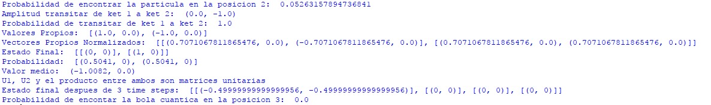
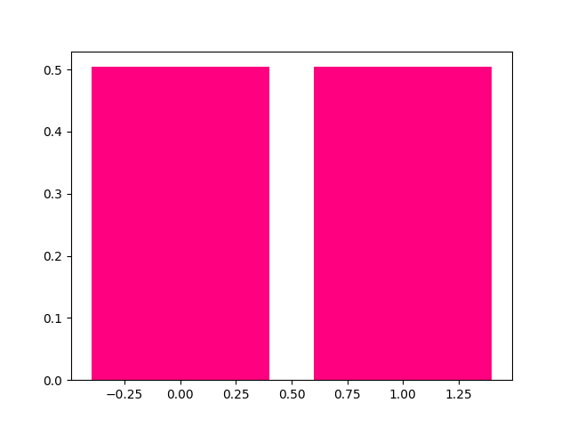
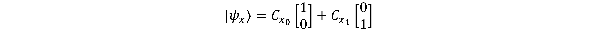
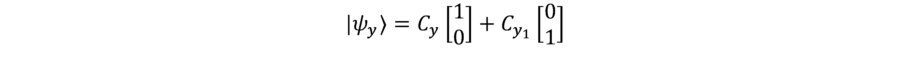
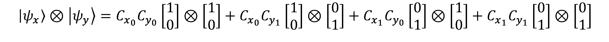
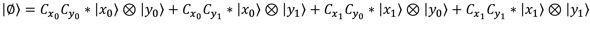
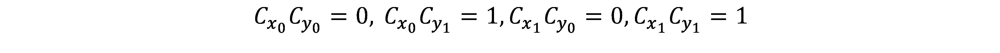
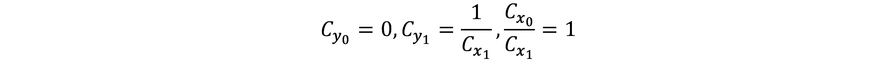

# Observables Y Medidas

_Esta librería contiene los retos de programación propuestos en el capítulo 4 del libro Quantum Computing For Computer Scientists, junto con el modelamiento de ejercicios del mismo capítulo._

## Funciones:

- Probabilidad Posición
- Amplitud Transición de ket
- Probabilidad
- Valor Esperado y Varianza
- Valores y Vectores propios
- Normalización de vector
- Probabilidad de pasar a un vector propio
- Valor medio con propios
- Grafica de vectores con probabilidad
- Dinámica de un observable

## Modelamiento Teoría cuántica básica

- Simulación capítulo 4.1
- Ejercicio 4.3.1
- Ejercicio 4.3.2
- Ejercicio 4.4.1
- Ejercicio 4.4.2

## Como funciona

Para el correcto uso de la librería *retos* y *modelado* se debe descargar *calculadoraMatrices.py* y *complejos.py*. 
Si quiere ejecutar las pruebas para los retos, ejecute *TestRetos.py*

## Como son las entradas:

- Para obtener los valores y vectores propios el observable se debe escribir siguiendo la estructura para matrices complejas de numpy.
### Ejemplo:
```
Observable = [[-1,-1j],[1j,1]] 
```
- Para el resto de funciones el observable se escribe de la siguiente forma:
Matrices: [[(R, I), (R, I)], [(R, I), (R, I)], ...]
### Ejemplo:
```
Observable = [[(1,0),(0,-1)],[(0,1),(2,0)]]

```
- Para los vectores, se sigue el siguiente parámetro:
Vectores de estado = [[(R, I)], [(R, I)], [(R, I)], ...]
### Ejemplo:
```
Ket = [[((2 ** 0.5) / 2, 0)], [(0, (2 ** 0.5) / 2)]]

```
*Siendo I y R la representación imaginaria y real de un número complejo respectivamente.*
*Para la función dinamica el número de pasos en el tiempo debe ser entero.*
## Como son las salidas:
- Para las funciones probabilidadPosicion y probabilidad, el resultado será un número real. 
```
Probabilidad = 0.05263157894736841
```

- Para la función amplitudTrasicionKet, el resultado será un número complejo. Si desea controlar el número de decimales puede usar la función redondear de la librería complejos.py
```
Amplitud = (0.0,-1.0)
```
- Para la función valorEsperadoYVarianza, el resultado será una tupla de complejos. Siendo el primer número complejo el valor esperado (media) y el segundo será la varianza.
```
ValorEsperadoYVarianza = (2.5000000000000004, 0.0), (0.25, 0.0))
```

- Para la función valoresPropios, el resultado será una tupla de vectores con números complejos. Siendo el primer vector complejo los valores esperados y el segundo los vectores propios normalizados.
```
ValoresPropios = ([(-1.414213562373095, 0.0), (1.4142135623730951, 0.0)], [[(0.9238795325112867, 0.0), (0.0, -0.3826834323650897)], [(0.0, -0.3826834323650898), (0.9238795325112867, 0.0)]])
```

- Para la función probabilidadPropios, el resultado será un vector con números complejos. 
```
ProbabilidadPropios = [(0.25, 0), (0.25, 0)]
```

- Para la función dinamica, el resultado será un vector con números complejos. 
```
Dinamica = [(-0.49999999999999956, -0.49999999999999956), (0, 0), (0, 0), (0, 0)]
```

## Prerrequisitos
Para asegurar el funcionamiento del simulador se recomienda tener instalado Python en su computador; preferiblemente la versión 3.9. Además, se debe tener instalada la librería matplot para poder mostrar las gráficas y la librería numpy para calcular los valores y vectores propios del observable.

## Explicación ejercicios
### Ejercicio 4.3.1
Para resolver este ejercicio, primero se calculan los valores propios, seguido d ellos vectores propios; estos deben ser *normalizados*. Estos resultados son sus posibles estados.
### Ejercicio 4.3.2
Para resolver este ejercicio, necesitamos los valores y vectores propios del ejercicio anterior. Se transforma el vector inicial para que quede como bra y se realiza producto interno con el vector propio normalizado. A ese resultado se le saca modulo al cuadrado. Los valores resultantes son la probabilidad de entrar a ese vector propio. Para sacar el valor medio se multiplica la probabilidad y el valor propio correspondiente y esos productos se suman.
### Ejercicios 4.4.1
Para resolver este ejercicio se debe multiplicar la adjunta por a matriz original y confirmar que este resultado es iguala la matriz de identidad. Se hace lo anterior con U1 y U2. Luego se multiplican ambas matrices U1*U2 y U2*U1 y se realiza el primer paso explicado. Al cumplir eso se verifica que U1, U2, U1*U2 y U2*U1 son unitarias.
### Ejercicios 4.4.2
Para resolver este ejercicio se verifica primero si el observable es unitario, después se multiplica por el mismo, el número de pasos (3 en este caso). Ese resultado se multiplica con el vector inicial, siendo este nuevo vector el estado final. Para calcular la probabilidad se calcula el modulo a cuadrado del número que este en la posición indicada sobre la longitud del vector al cuadrado; siendo la longitud la norma del vector.
### Resultado Modelado





### Discusión ejercicio 4.5.2
Para resolver este ejercicio debemos recordar que la partícula solo puede ir arriba o abajo por ende se habla en términos de _x_ y _y_, dando el siguiente resultado:





Teniendo esos estados se hace producto tensor:



Este resultado es el vector genérico del sistema.

### Discusión ejercicio 4.5.3
Basándose en el ejemplo 4.5.2 creamos el siguiente vector genérico:



Y establecemos las siguientes igualdades:



Al despejar los complejos resulta en estas equivalencias:



Con estas equivalencias confirmamos que el estado es separable.
## Built with

Pycharm Community Editor 2020.3.2

## Autores

María José Torres Nieves - Estudiante ingeniería de sistemas.


